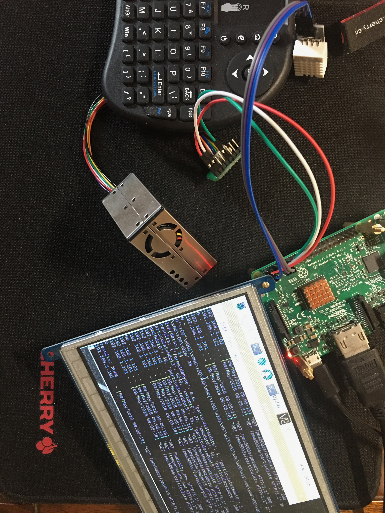
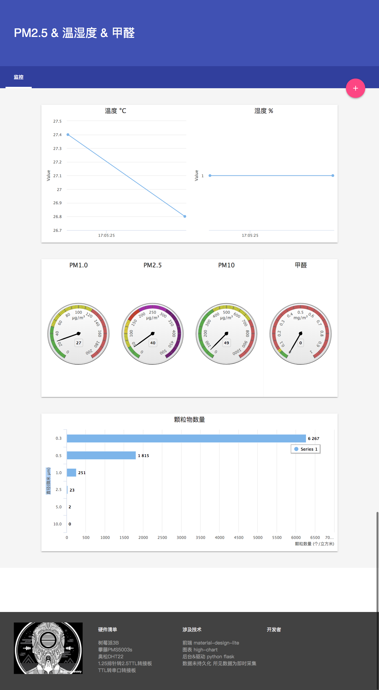

Raspberry Pi Air Quality
===
## Brief
Status: Obsoleted 废弃  
Year: 2015  

After having self-studied Python and Flask in 2015, I came into contact with Raspberry Pi, it's very interesting,
playing with hardware and sensors.  

  

## Tech stack
- Hardware:  
  - Raspberry Pi 3B  
  - PlanTower PMS5003s(G5s) PM2.5 laser dust sensor  
  - Aoson DHT22(AM2302) temperature and humidity sensor  
- Frontend: Material UI  High-chat
- Backend: Flask

limited by my ability at that time,  
Deficiency:  
- Frequency requests from frontend to backend results error, because request will call sensor directly, 
backend not use a database or global variable to cache sensor data.  
- Data of High-charts rendered from Flask template syntax, which should be asynchronous via js ajax, 
due to the poor frontend ability at that time, hence need to request frequently to update chart.  

And the tech stack is outdated now, so this project is obsoleted. Maybe refactor in the future.

## Screen shot
  
  
Enrolling publicity course on DouYin(TikTok) ask by ex-company in 2021.  
  

